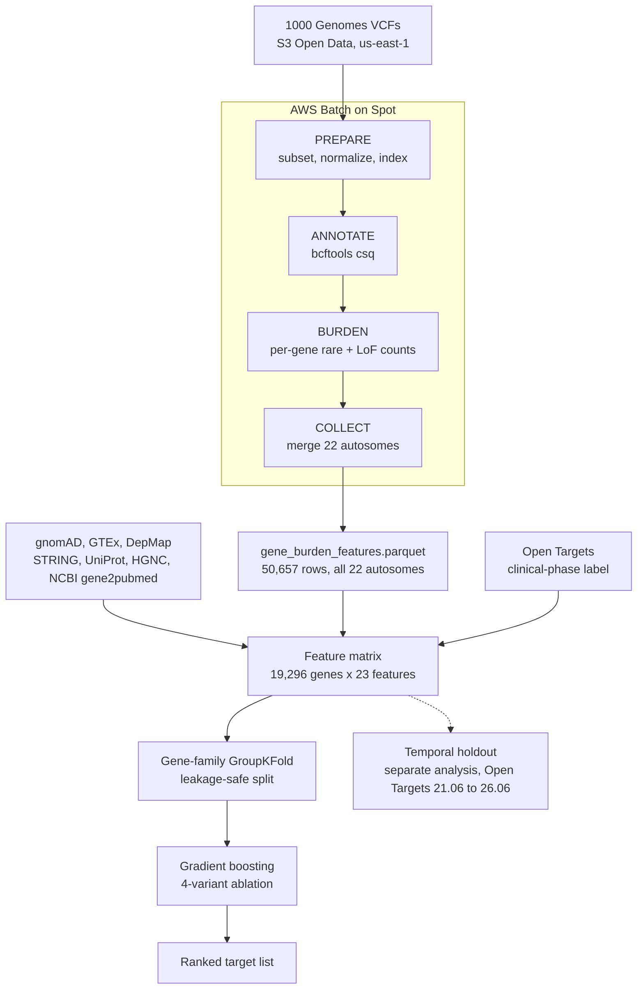

# drug-discovery-target-prioritization

An AI-driven pipeline that turns population genetic data into ML-ranked druggable targets, scored against real clinical outcomes.

> [!NOTE]
> This is a portfolio project. The result below is real but modest: measurable evidence that mechanistic biology features predict future clinical development, not a claim of having found a novel drug target. Full rationale in [DESIGN.md](DESIGN.md).

## Architecture



## What it found

- **Temporal holdout (the strongest test here):** trained on Open Targets release 21.06, evaluated on the 338 genes that gained a clinical-phase drug by release 26.06, genuinely prospective. 5.59x enrichment in the top 1%, above the resampled baseline CI at every threshold.

> [!IMPORTANT]
> The trained model does not clearly beat sorting genes by DepMap essentiality alone on this same test (lift 5.03x for the single-feature baseline vs. 2.95x for the model). Stated plainly rather than smoothed over, see [Results in detail](#results-in-detail) below.

- **Real signal on understudied genes:** a median split by publication count puts all four feature-set variants' bottom-half lift 95% CI entirely above 1.0, including a variant with every publication-history and network-centrality feature removed.
- **Burden coverage 86.68%** of the protein-coding universe (16,725 / 19,296 genes) from a full 22-autosome AWS Batch run, for **under $1** total spend.

## How it works

**Pipeline (AWS Batch, Spot only):** subsets, normalizes, and annotates 1000 Genomes variants with `bcftools csq`, counts rare and LoF variants per gene, merges all 22 autosomes into one Parquet file.

**Feature assembly (local, no AWS):** gnomAD, GTEx/DepMap, STRING, AlphaFold, HGNC, and NCBI publication metadata join onto the burden output and an Open Targets label, producing a 19,296-gene by 23-feature training table.

**Evaluation:** gene-family GroupKFold (no paralog leaks train/test), a 4-variant feature-set ablation for study bias, and the temporal holdout above as a separate, stricter analysis. Full rationale in [DESIGN.md](DESIGN.md).

## Getting started

<details>
<summary><b>Full setup and run instructions</b></summary>

### 1. Provision infrastructure

`terraform.tfvars` is gitignored (it holds `budget_alert_email`, a real address for the AWS Budgets alarm), so anyone cloning this repo needs to create their own before applying:

```
cd terraform
cat > terraform.tfvars <<'EOF'
budget_alert_email = "you@example.com"
EOF
terraform init
terraform apply
```

Tear down between work sessions to guarantee nothing is left billing:

```
terraform destroy
```

### 2. Run the pipeline

Single-chromosome mode validates the full DAG on one chromosome (all 2,504 1000 Genomes samples) inside the default vCPU limit, before any quota increase:

```bash
# Fetch the chr22 VCF and reference files (run from us-east-1 for zero egress)
bash data/fetch_1000genomes.sh
bash data/fetch_ref.sh

# Build the Python container for the burden and collect steps.
# --platform linux/amd64 is required: the pipeline requests amd64 and an ARM Mac
# otherwise builds an arm64 image that the run cannot find.
docker build --platform linux/amd64 --load -t drug-target-burden:1.0 pipeline/docker/

# Run the local validation (chr22, all samples, AF < 1%)
nextflow run pipeline/main.nf -profile local
```

Results land in `results/gene_burden_features.parquet`.

Multi-chromosome mode (used for the full 22-autosome run behind the results below) fans the same PREPARE/ANNOTATE/BURDEN DAG out per chromosome on AWS Batch and feeds every chromosome's output into one COLLECT:

```bash
for c in $(seq 1 22); do bash data/fetch_1000genomes.sh $c; bash data/fetch_ref.sh $c; done

nextflow run pipeline/main.nf -profile awsbatch \
  --chroms 1,2,3,4,5,6,7,8,9,10,11,12,13,14,15,16,17,18,19,20,21,22 \
  --ecr_repository_url $(terraform -chdir=terraform output -raw ecr_repository_url) \
  --ecr_bcftools_batch_repository_url $(terraform -chdir=terraform output -raw ecr_bcftools_batch_repository_url) \
  --batch_job_role_arn $(terraform -chdir=terraform output -raw batch_job_role_arn)
```

### 3. Build the ML layer (runs locally, no AWS needed)

Each script is idempotent and caches its output in `ml/cache/`. Run them in order; each step checks that its inputs exist and exits with a clear error if a prerequisite is missing.

```bash
# Dependencies (once)
pip install pandas pyarrow scikit-learn networkx scipy shap matplotlib

# Step 1: download HGNC protein-coding gene universe and build group keys
# for the family-safe cross-validation split.
python3 ml/gene_families.py

# Step 2: download gnomAD v2.1.1 constraint metrics (pLI, LOEUF, oe_lof, oe_mis).
# ~4.6 MB download, cached to ml/cache/.
python3 ml/fetch_gnomad.py

# Step 3: download UniProt Swiss-Prot protein features (protein_length).
# ~3-5 MB download, cached to ml/cache/.
python3 ml/fetch_alphafold.py

# Step 4: download STRING v12 PPI network and compute per-gene degree and
# approximate betweenness centrality (~85 MB download, ~2-5 min to compute).
python3 ml/fetch_string.py

# Step 5: download GTEx v8 median tissue TPM (compute tau, tissue-specificity
# index) and DepMap 24Q4 CRISPR gene effect (mean essentiality score across
# cell lines). ~7 MB + ~430 MB download; the DepMap download is the long pole.
python3 ml/fetch_expression.py

# Step 6: download NCBI gene2pubmed (~272 MB) and compute publication count
# and first-described year per gene -- the deliberate confounder feature
# (DESIGN.md section 5), used by the study-bias check in step 10.
python3 ml/fetch_publications.py

# Step 7: fetch Open Targets label data (knownDrugsAggregated).
python3 data/fetch_chembl_known_drugs.py

# Step 8: assemble the training table (gene universe + gnomAD + AlphaFold +
# STRING + GTEx/DepMap + publication metadata + burden + label). Requires
# results/gene_burden_features.parquet, produced directly by COLLECT in the
# multi-chromosome pipeline run across all 22 autosomes (step 2 above); a
# single run over all 22 chromosomes needs no separate merge step.
python3 ml/build_features.py

# Step 9: GroupKFold split on gene family -- prevents paralog leakage.
# Asserts zero group overlap in every fold.
python3 ml/split.py

# Step 10: train and evaluate. Prints PR-AUC, precision@k, and enrichment
# factor per fold and averaged, plus the study-bias check (score vs.
# publication count, PR-AUC by pub-count tercile). Writes OOS predictions
# to ml/cache/. Use --compare for the full feature-set ablation table, or
# --feature-set <name> to run and save OOS predictions for one variant
# (the validation scripts below expect a biology_only run specifically).
python3 ml/train_eval.py --compare
python3 ml/train_eval.py --feature-set biology_only

# Optional: three standalone validations, none of which retrain anything.
# See the Results section below for what each one found.
python3 ml/validate_genetic_evidence.py     # orthogonal check against Open Targets Genetics
python3 ml/validate_prospective_labels.py   # 24.09 -> 26.06 newly-labeled genes (weak, n=30)
python3 ml/temporal_holdout.py              # 21.06 -> 26.06 temporal holdout (strong, n=338)

# Optional: regenerate the three figures embedded in the Results section
# below from the numbers already established by the runs above.
python3 ml/make_figures.py
```

Full output file listing in DESIGN.md section 12.5.

</details>

## Results in detail

### Temporal holdout

| top fraction | observed rate | baseline mean | baseline 95% CI | enrichment |
|---|---|---|---|---|
| 1% | 0.056 | 0.010 | [0.000, 0.021] | 5.59x |
| 5% | 0.178 | 0.050 | [0.027, 0.074] | 3.57x |
| 10% | 0.322 | 0.100 | [0.071, 0.133] | 3.22x |
| 20% | 0.533 | 0.201 | [0.160, 0.249] | 2.66x |


PR-AUC 0.055 vs. a base rate of 0.0187 (lift 2.95x), on a feature set with `pub_count` and STRING dropped entirely, not just excluded from one variant. Method in `ml/temporal_holdout.py` and DESIGN.md section 6.4.

### Single-feature baselines: does the model earn its place?

Same pool, same 338 prospective positives, same thresholds, same resampled baseline CI as the table above:

| ranking | top 1% | top 5% | top 10% | top 20% | PR-AUC | lift |
|---|---|---|---|---|---|---|
| model (trained) | 5.59x | 3.57x | 3.22x | 2.66x | 0.0550 | 2.95x |
| LOEUF | 2.06x | 2.02x | 1.77x | 1.74x | 0.0294 | 1.57x |
| pLI | 1.47x | 1.37x | 1.65x | 2.01x | 0.0282 | 1.51x |
| oe_mis | 3.53x | 2.62x | 2.51x | 1.96x | 0.0361 | 1.93x |
| essentiality_score | 14.71x | 4.76x | 2.75x | 1.76x | 0.0939 | 5.03x |
| disorder_fraction | 2.94x | 2.68x | 2.13x | 1.62x | 0.0311 | 1.67x |
| protein_length | 2.06x | 1.19x | 0.92x | 0.93x | 0.0188 | 1.01x |

`essentiality_score` alone beats the trained model (5.03x vs. 2.95x lift), partly because 50 of the 338 prospective positives are pan-essential ribosomal protein genes. Reported as is, not smoothed over; only tested for the temporal holdout, not the main ablation below. Details in `ml/temporal_holdout.py`.

### Median split: real signal, and how much discovery-history features add

| variant | bottom-half lift | 95% CI |
|---|---|---|
| all_features | 5.28 | [3.99, 7.76] |
| no_pubcount | 5.62 | [4.15, 8.13] |
| no_pubcount_no_string | 4.52 | [3.34, 7.04] |
| biology_only | 2.76 | [2.17, 4.00] |


Every variant clears 1.0 (real signal, not study bias). `biology_only` and `all_features` CIs now nearly overlap since `disorder_fraction` was added, weaker evidence for discovery-history features than an earlier pass found. Extended discussion and the open study-bias-vs-biology question in DESIGN.md 12.2-12.3.

### n_rare importance trend, SHAP, stability selection, and secondary checks

`n_rare`'s feature importance in `biology_only` climbed monotonically with burden coverage across three stages of this project: 0.0112 (2.0%) -> 0.0352 (29.3%) -> 0.0714 (86.68%), consistent across all four variants.


The 13.32% burden coverage gap is two different things, not one: 896 genes on X/Y, out of scope by design, and 1,675 that are genuine missingness (no qualifying rare variant, or a symbol gap between GFF3 and HGNC).

SHAP and `feature_importances_` broadly agree on what matters. Bootstrap stability selection (50 resamples) confirms the core biology features are selected 96-100% of the time, not a lucky sample. Two smaller external-evidence checks are directionally consistent but individually underpowered (one gene, KCNMA1, is a notable n=1 anecdote: ranked top 1% and later gained a clinical-phase drug). Full numbers in DESIGN.md sections 12.1 and 12.4.

### Cost

Under $1 total for the full 22-autosome run. 2h32m wall clock running all 17 remaining autosomes concurrently on Batch, a roughly 9x speedup from raising `max_vcpus` from 4 to 8. Breakdown in DESIGN.md section 9.

## Limitations

> [!WARNING]
> Read before citing any result above out of context.

- **No druggability features.** Top-ranked understudied genes skew toward essential core machinery (spliceosome, ribosomes), a famously undrugged class. High rank means "important and understudied," not "druggable."
- **The label is not monotonically increasing.** Genes move from labeled back to unlabeled between releases (7 genes 24.09 to 26.06, 4 genes 21.06 to 26.06), most plausibly database churn.
- **Temporal holdout time-stability assumptions are unverified per feature.** Constraint, burden, tau, protein length, DepMap essentiality treated as stable back to 2021. DepMap is the weakest, it has grown substantially since.
- **Sample sizes vary a lot.** The temporal holdout (338 positives) has real power; the 24.09-to-26.06 check (30) and genetic-evidence top-50 slice do not.
- **Pathway-level leakage.** GroupKFold prevents paralog leakage, not complex-level leakage. Our top-ranked genes are spliceosome components, a live concern, not theoretical.
- **DepMap cancer bias.** Essentiality comes from cancer cell-line panels, a specific, unrepresentative context, separate from time-stability above.
- **SHAP with correlated features.** The four gnomAD constraint metrics are highly correlated; SHAP can split importance among them arbitrarily. Read `tau` vs. `disorder_fraction` as "both strong," not a firm ordering.

## Repository layout

```
terraform/        Infrastructure as code (VPC, Batch, IAM, S3 endpoint, ECR, budget alarm)
pipeline/         Nextflow pipeline (PREPARE, ANNOTATE, BURDEN, COLLECT), multi-chromosome capable
ml/               Feature engineering, leakage-safe split, training, evaluation, validation scripts
data/             Data-layer build scripts: Open Targets, ChEMBL
docs/figures/     Results figures embedded above, regenerated by ml/make_figures.py
DESIGN.md         Full design rationale and extended results discussion
README.md         This file
```

`ml/train_eval.py` is the main ablation script; `ml/temporal_holdout.py` and the two `ml/validate_*.py` scripts are standalone and don't touch it. Full rationale in [DESIGN.md](DESIGN.md).

## Status checklist

- [x] Terraform stack applies and destroys cleanly
- [x] Pipeline validated end to end, single chromosome and full 22-autosome run
- [x] Data layer (Open Targets, ChEMBL) built and labels defined
- [x] ML layer built and validated locally
- [x] Scaling benchmark run after quota increase (22 autosomes, concurrent Batch execution, under $1, 2h32m)
- [x] Results writeup (this README, DESIGN.md sections 6, 9, and 12)
- [x] Architecture diagram
