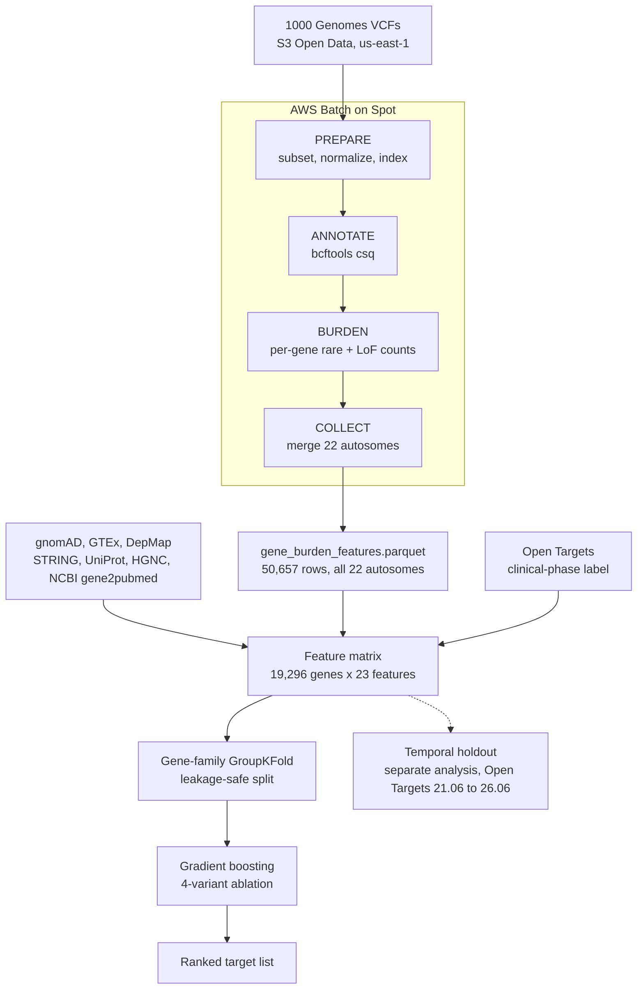
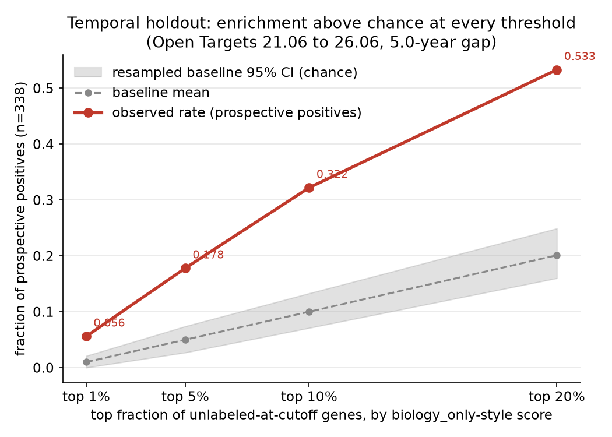
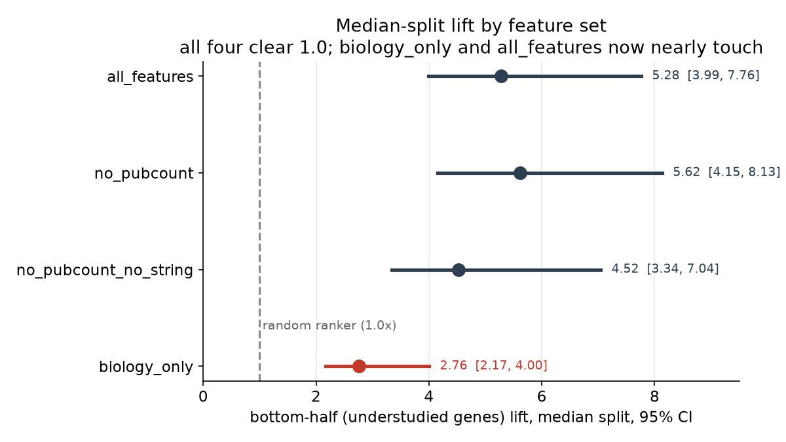
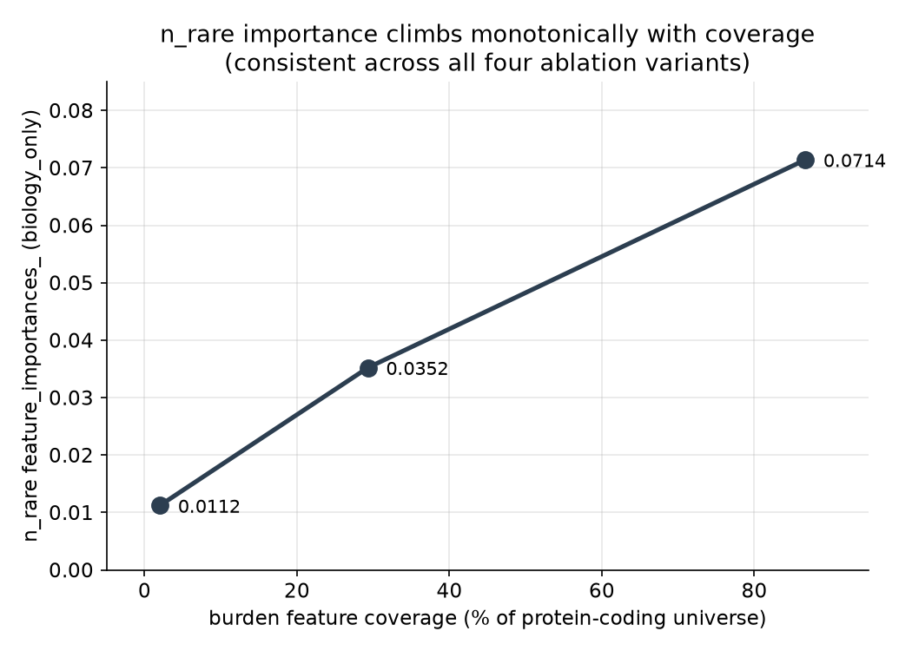

# drug-discovery-target-prioritization

An AI-driven pipeline that turns population genetic data into ML-ranked druggable targets, scored against real clinical outcomes. Nextflow on AWS Batch for the pipeline, Terraform for the infrastructure, and a leakage-safe ML layer for target prioritization.

Status: pipeline and ML layer both complete and validated, including a prospective temporal holdout. See `DESIGN.md` for the full design rationale and the Results section below for what the model actually found. This is a portfolio project: a real but modest result, not a claim of novel drug discovery.

## What it does

1. Ingests public population variant data (1000 Genomes, AWS Open Data, in-region).
2. Runs a Nextflow pipeline on AWS Batch to produce gene-level genetic evidence.
3. Assembles a per-gene feature matrix (constraint, protein-intrinsic, network, expression).
4. Trains a leakage-safe model to prioritize genes by druggability, using clinical-phase drug existence as the label.
5. Outputs a ranked target list with feature-importance-based interpretability and a study-bias analysis.

## Why it is built this way

Target identification is the highest-value and highest-failure decision in drug discovery. This project predicts a genuine downstream outcome (does a target have a drug at clinical phase >= 1) from biology alone, with evaluation designed to prove the model is not simply learning which genes are famous. Full reasoning in `DESIGN.md`.

## Architecture

Networking uses public subnets with an Internet Gateway and an S3 Gateway VPC Endpoint, deliberately avoiding a NAT Gateway for cost. All infrastructure is provisioned with Terraform.

The original design (DESIGN.md section 2) planned a Glue + Athena tabular
evidence layer between the pipeline and ML training. That layer was never
built: the actual path is simpler, the Nextflow pipeline's Parquet output is
read directly by `ml/build_features.py` with pandas, with no Glue crawler or
Athena query layer in between. The Batch compute environment is Spot only
(`terraform/batch.tf`); there is no separate on-demand environment for
aggregation steps.



Only 16,725 of the 50,657 burden rows end up matching the 19,296-gene
universe (86.68%, see Results below); the rest are non-protein-coding
symbols or genes with no qualifying rare variant in this call set. The
temporal holdout branches off separately because it trains on a different,
older label and a restricted feature set (no `pub_count`, no STRING), not
because it is a later step in the same pipeline run.

## Repository layout

```
terraform/        Infrastructure as code (VPC, Batch, IAM, S3 endpoint, ECR, budget alarm)
pipeline/         Nextflow pipeline (PREPARE, ANNOTATE, BURDEN, COLLECT), multi-chromosome capable
ml/               Feature engineering, leakage-safe split, training, evaluation, validation scripts
data/             Data-layer build scripts: Open Targets, ChEMBL
docs/figures/     Results figures embedded below, regenerated by ml/make_figures.py
DESIGN.md         Full design rationale
README.md         This file
```

`ml/train_eval.py` is the main ablation and evaluation script (`--compare` for
the full feature-set comparison, `--feature-set <name>` for a single
variant). Three standalone scripts hold analyses that intentionally do not
touch it: `ml/validate_genetic_evidence.py` and
`ml/validate_prospective_labels.py` (orthogonal validations, see Results
below) and `ml/temporal_holdout.py` (the prospective temporal holdout, the
strongest result in the project).

## Getting started

### 1. Provision infrastructure

`terraform.tfvars` is gitignored (it holds `budget_alert_email`, a real
address for the AWS Budgets alarm), so anyone cloning this repo needs to
create their own before applying:

```
cd terraform
cat > terraform.tfvars <<'EOF'
budget_alert_email = "you@example.com"
EOF
terraform init
terraform apply
```

Tear down between work sessions to guarantee nothing is left billing:

```
terraform destroy
```

### 2. Run the pipeline

Single-chromosome mode validates the full DAG on one chromosome (all 2,504 1000 Genomes samples) inside the default vCPU limit, before any quota increase:

```bash
# Fetch the chr22 VCF and reference files (run from us-east-1 for zero egress)
bash data/fetch_1000genomes.sh
bash data/fetch_ref.sh

# Build the Python container for the burden and collect steps.
# --platform linux/amd64 is required: the pipeline requests amd64 and an ARM Mac
# otherwise builds an arm64 image that the run cannot find.
docker build --platform linux/amd64 --load -t drug-target-burden:1.0 pipeline/docker/

# Run the local validation (chr22, all samples, AF < 1%)
nextflow run pipeline/main.nf -profile local
```

Results land in `results/gene_burden_features.parquet`.

Multi-chromosome mode (used for the full 22-autosome run behind the results
below) fans the same PREPARE/ANNOTATE/BURDEN DAG out per chromosome on AWS
Batch and feeds every chromosome's output into one COLLECT:

```bash
for c in $(seq 1 22); do bash data/fetch_1000genomes.sh $c; bash data/fetch_ref.sh $c; done

nextflow run pipeline/main.nf -profile awsbatch \
  --chroms 1,2,3,4,5,6,7,8,9,10,11,12,13,14,15,16,17,18,19,20,21,22 \
  --ecr_repository_url $(terraform -chdir=terraform output -raw ecr_repository_url) \
  --ecr_bcftools_batch_repository_url $(terraform -chdir=terraform output -raw ecr_bcftools_batch_repository_url) \
  --batch_job_role_arn $(terraform -chdir=terraform output -raw batch_job_role_arn)
```

### 3. Build the ML layer (runs locally, no AWS needed)

Each script is idempotent and caches its output in `ml/cache/`. Run them in
order; each step checks that its inputs exist and exits with a clear error if
a prerequisite is missing.

```bash
# Dependencies (once)
pip install pandas pyarrow scikit-learn networkx scipy shap matplotlib

# Step 1: download HGNC protein-coding gene universe and build group keys
# for the family-safe cross-validation split.
python3 ml/gene_families.py

# Step 2: download gnomAD v2.1.1 constraint metrics (pLI, LOEUF, oe_lof, oe_mis).
# ~4.6 MB download, cached to ml/cache/.
python3 ml/fetch_gnomad.py

# Step 3: download UniProt Swiss-Prot protein features (protein_length).
# ~3-5 MB download, cached to ml/cache/.
python3 ml/fetch_alphafold.py

# Step 4: download STRING v12 PPI network and compute per-gene degree and
# approximate betweenness centrality (~85 MB download, ~2-5 min to compute).
python3 ml/fetch_string.py

# Step 5: download GTEx v8 median tissue TPM (compute tau, tissue-specificity
# index) and DepMap 24Q4 CRISPR gene effect (mean essentiality score across
# cell lines). ~7 MB + ~430 MB download; the DepMap download is the long pole.
python3 ml/fetch_expression.py

# Step 6: download NCBI gene2pubmed (~272 MB) and compute publication count
# and first-described year per gene -- the deliberate confounder feature
# (DESIGN.md section 5), used by the study-bias check in step 10.
python3 ml/fetch_publications.py

# Step 7: fetch Open Targets label data (knownDrugsAggregated).
python3 data/fetch_chembl_known_drugs.py

# Step 8: assemble the training table (gene universe + gnomAD + AlphaFold +
# STRING + GTEx/DepMap + publication metadata + burden + label). Requires
# results/gene_burden_features.parquet, produced directly by COLLECT in the
# multi-chromosome pipeline run across all 22 autosomes (step 2 above); a
# single run over all 22 chromosomes needs no separate merge step.
python3 ml/build_features.py

# Step 9: GroupKFold split on gene family -- prevents paralog leakage.
# Asserts zero group overlap in every fold.
python3 ml/split.py

# Step 10: train and evaluate. Prints PR-AUC, precision@k, and enrichment
# factor per fold and averaged, plus the study-bias check (score vs.
# publication count, PR-AUC by pub-count tercile). Writes OOS predictions
# to ml/cache/. Use --compare for the full feature-set ablation table, or
# --feature-set <name> to run and save OOS predictions for one variant
# (the validation scripts below expect a biology_only run specifically).
python3 ml/train_eval.py --compare
python3 ml/train_eval.py --feature-set biology_only

# Optional: three standalone validations, none of which retrain anything.
# See the Results section below for what each one found.
python3 ml/validate_genetic_evidence.py     # orthogonal check against Open Targets Genetics
python3 ml/validate_prospective_labels.py   # 24.09 -> 26.06 newly-labeled genes (weak, n=30)
python3 ml/temporal_holdout.py              # 21.06 -> 26.06 temporal holdout (strong, n=338)

# Optional: regenerate the three figures embedded in the Results section
# below from the numbers already established by the runs above.
python3 ml/make_figures.py
```

Outputs:
- `ml/cache/gene_families.parquet` -- gene universe with group keys
- `ml/cache/gnomad_constraint.parquet` -- constraint metrics
- `ml/cache/alphafold_features.parquet` -- protein length (UniProt Swiss-Prot)
- `ml/cache/string_features.parquet` -- PPI degree and betweenness (STRING v12)
- `ml/cache/expression_features.parquet` -- tissue-specificity (tau, GTEx) and essentiality (DepMap)
- `ml/cache/publication_features.parquet` -- pub_count and year_first_described (NCBI gene2pubmed)
- `ml/cache/training_table.parquet` -- full feature matrix, 19,296 genes. Burden features (n_rare, n_lof) cover 16,725 genes (86.68% of the protein-coding universe, 91.0% of the autosome-eligible universe), the rest zero-filled per the documented missing-data convention.
- `ml/cache/cv_folds.parquet` -- fold assignments (GroupKFold, n=5)
- `ml/cache/oos_predictions.parquet` -- out-of-sample scores, labels, and ranks for whichever `--feature-set` was last run

## Results

This is a portfolio project. The result below is real but modest: measurable
evidence that mechanistic biology features predict future clinical
development, not a claim of having found a novel drug target.

### Primary result: temporal holdout

The strongest test in this project, and the only one with enough positives
for real statistical power. Built from Open Targets' own release history
instead of hand-assembled clinical trial dates: an old release's
clinical-phase label is "the past," a current release is "the future."

Trained on the 1,196 genes labeled at Open Targets release 21.06 (June
2021), using a feature set with `pub_count` and STRING centrality (PPI
degree, betweenness) **dropped, not just excluded from one ablation
variant**, so fame-riding is ruled out by construction rather than by
argument. Evaluated against the 338 genes that were unlabeled at 21.06 and
gained a clinical-phase drug by release 26.06 (June 2026), a 5.0-year gap.

| top fraction | observed rate | baseline mean | baseline 95% CI | enrichment |
|---|---|---|---|---|
| 1% | 0.056 | 0.010 | [0.000, 0.021] | 5.59x |
| 5% | 0.178 | 0.050 | [0.027, 0.074] | 3.57x |
| 10% | 0.322 | 0.100 | [0.071, 0.133] | 3.22x |
| 20% | 0.533 | 0.201 | [0.160, 0.249] | 2.66x |



Enrichment sits above the resampled baseline's 95% CI at every threshold
tested. PR-AUC on the prospective set: 0.055 against a base rate of 0.0187
(lift 2.95x). This is a stricter, narrower feature set than the main
ablation variants below, so it is not a like-for-like comparison to them;
that it still shows this much enrichment, with the two features most
plausibly tracking fame removed, is the point. Full method and caveats in
`ml/temporal_holdout.py` and DESIGN.md section 6.4.

**A random ranker is a low bar. Does the trained model beat sorting genes
by one well-known biology feature alone?** Same pool, same 338 prospective
positives, same thresholds, same resampled baseline CI:

| ranking | top 1% | top 5% | top 10% | top 20% | PR-AUC | lift |
|---|---|---|---|---|---|---|
| model (trained) | 5.59x | 3.57x | 3.22x | 2.66x | 0.0550 | 2.95x |
| LOEUF | 2.06x | 2.02x | 1.77x | 1.74x | 0.0294 | 1.57x |
| pLI | 1.47x | 1.37x | 1.65x | 2.01x | 0.0282 | 1.51x |
| oe_mis | 3.53x | 2.62x | 2.51x | 1.96x | 0.0361 | 1.93x |
| essentiality_score | 14.71x | 4.76x | 2.75x | 1.76x | 0.0939 | 5.03x |
| disorder_fraction | 2.94x | 2.68x | 2.13x | 1.62x | 0.0311 | 1.67x |
| protein_length | 2.06x | 1.19x | 0.92x | 0.93x | 0.0188 | 1.01x |

**The trained model does not clearly beat the best single-feature
baseline on this test.** Sorting by `essentiality_score` alone (DepMap,
more negative Chronos score ranked higher) reaches lift 5.03x, ahead of
the model's 2.95x, a 41% margin in the baseline's favor. Looking at what
drives that number: 50 of the 338 prospective positives are ribosomal
protein genes, which are pan-essential by Chronos across nearly all cell
lines, so a large share of `essentiality_score`'s top-1% enrichment
(14.71x) comes from one gene family rather than a broad-based signal.
This is reported plainly rather than smoothed over: on this specific
prospective test, with a restricted, time-stable feature set and n=338, a
single well-chosen feature is competitive with, and here beats, the
trained model. This comparison was run only for the temporal holdout;
whether the main ablation's variants (Q1 and Q2 below) beat single-feature
baselines on their own evaluation was not separately tested, so no claim is
made about that. What this section does establish is narrower and more
honest: the temporal holdout's own headline enrichment numbers should not
be read as proof the trained model outperforms simple biology-based
sorting, on this particular test, it does not. Full baseline definitions,
direction choices, and this comparison in `ml/temporal_holdout.py`.

### Q1: is there real signal on understudied genes, or was the model riding study bias?

**Yes, real signal.** The properly powered test is a median split by
publication count (159 positives in the bottom half vs. 60 in the earlier
tercile-based low group). Every feature-set variant's bottom-half lift 95%
CI sits entirely above 1.0:

| variant | bottom-half lift | 95% CI |
|---|---|---|
| all_features | 5.28 | [3.99, 7.76] |
| no_pubcount | 5.62 | [4.15, 8.13] |
| no_pubcount_no_string | 4.52 | [3.34, 7.04] |
| biology_only | 2.76 | [2.17, 4.00] |

(Numbers above include `disorder_fraction`, added to the feature set after
this table was first produced; see "SHAP and bootstrap stability selection"
below. `biology_only` is now 16 features, `all_features` 23.)



Every variant's CI clears the 1.0 reference line, which is the whole Q1
answer. `biology_only`'s CI and `all_features`' CI now nearly touch
(2.17-4.00 vs. 3.99-7.76), see Q2 below for what changed.

The model beats a random ranker on understudied genes even with every
publication-history and network-centrality feature removed (`biology_only`).
An earlier tercile-based analysis (60 positives in the low-publication
group) had concluded this was "not distinguishable from noise." That
conclusion was a power artifact of an underpowered stratification, not a
genuine null; the median split resolves it.

### Q2: do discovery-history features add information beyond mechanistic biology?

**Weaker than an earlier version of this analysis found, and the update
itself is the interesting part.** Paired bootstrap comparison of
`biology_only` vs. `no_pubcount` on identical folds, computed on the
low-publication-tercile lift: mean difference -8.00, 95% CI
[-17.19, +0.21], sign test still 1-4 (one fold favored `biology_only`, four
favored `no_pubcount`, same direction as before). The CI now includes zero.
The median-split comparison tells the same story: `biology_only`
[2.17, 4.00] vs. `all_features` [3.99, 7.76] now overlap by a hair (0.01).

Before `disorder_fraction` was added to the feature set, this same paired
bootstrap excluded zero (mean diff -8.33, 95% CI [-16.84, -0.03]) and the
median-split CIs did not overlap ([2.12, 3.64] vs. [3.98, 7.25]), the basis
for an earlier "yes, measurably" answer here. Adding one more real,
time-stable biology feature closed most of that gap: `disorder_fraction`
turns out to be one of the two most important features in `biology_only`
by SHAP (co-dominant with `tau`, see below), and it is stable across
resampling (selected in 100% of bootstrap resamples in every variant). The
sign test direction hasn't changed (`no_pubcount` and `all_features` still
edge out `biology_only` in 4 of 5 folds), so there may still be a real,
small effect, but it is no longer distinguishable from sampling noise at
conventional confidence with the current feature set and fold count.

This is reported as the update it is, not smoothed over: the honest
answer to Q2 moved from "yes" to "no longer clearly yes" when the feature
set became more complete, which is itself evidence for the Open Question
below, that missing biology, not just fame, was likely responsible for
some of what looked like a discovery-history-features effect.

### Open question: how much of that benefit is study bias vs. genuine biology?

**Not resolved, and stated as such rather than argued around.** Descriptive
Spearman correlation between `year_first_described` and the biology features
already in `biology_only`:

| feature | rho | p-value |
|---|---|---|
| loeuf | 0.203 | 6.45e-179 |
| oe_lof | 0.166 | 5.76e-119 |
| tau | 0.159 | 1.91e-109 |
| oe_mis | 0.152 | 1.47e-100 |
| pLI | -0.110 | 7.49e-53 |
| essentiality_score | 0.073 | 2.72e-24 |
| protein_length | -0.066 | 6.64e-20 |

Max |rho| is 0.203. At n=19,296, p-values this small are not informative on
their own; with this many genes, even trivial correlations clear any
conventional significance threshold, so the magnitudes are what matter, and
they are small to moderate. This table is descriptive only, not a
decomposition: it shows discovery timing is entangled with biology, it does
not tell us how much of `year_first_described`'s contribution in Q2 is fame
vs. biology. Critically, `biology_only` already contains `pLI`, `loeuf`,
`oe_mis`, `oe_lof`, and `essentiality_score`, so whatever
`year_first_described` adds on top of `biology_only` is, by construction,
not the signal those features already capture; these correlations cannot
explain that gap away. A residualization scheme (regressing
`year_first_described` on biology features and calling the residual "pure
fame") was deliberately not implemented: that residual would contain
technological accessibility, funding history, disease salience, and noise,
not just fame, and is a causal claim this project cannot support.

`disorder_fraction` was not included in this correlation table (it was
added to the feature set after this table was first produced), but the Q2
update above is directly relevant here: closing most of the `biology_only`
vs. `all_features` gap by adding one more real biology feature is
consistent with a meaningful share of the original gap being missing
biology rather than fame, though it does not prove it, `disorder_fraction`
could itself happen to correlate with discovery timing the same way the
table above's features do. That correlation was not separately checked.

### SHAP and bootstrap stability selection

Two methodology items from DESIGN.md (sections 6.2, 6.5, 7), previously
listed here as deferred, are now implemented in `ml/train_eval.py` and run
as part of `--compare`.

**SHAP** (`shap.TreeExplainer` on the same full-data model used for
`feature_importances_`): the two importance mechanisms broadly agree, and
where they disagree, the disagreement is informative. In `biology_only`,
`feature_importances_` ranks `tau` first (0.213) and `disorder_fraction`
fourth (0.120); SHAP ranks them essentially tied for first (`tau` 0.373,
`disorder_fraction` 0.371), both well clear of everything else. Both
methods agree `disorder_fraction` is a top-tier contributor, not a minor
one, contrary to what was expected here going in (a real but likely
secondary contributor was the working assumption before this run).

**Bootstrap stability selection** (50 row-level resamples of the full
training set, refit each time, tracks how often each feature lands in the
top 10 by `feature_importances_`, features selected in more than 70% of
resamples flagged as stable): the core biology features, gnomAD
constraint (`pLI`, `loeuf`, `oe_mis`, `oe_lof`), burden (`n_rare`),
expression (`tau`, `essentiality_score`), and structure (`protein_length`,
`disorder_fraction`), are selected in 96 to 100% of resamples across all
four variants. `pub_count` and `year_first_described`, where present, are
also stable at 100%, consistent with real (if confounded) predictive
signal rather than noise. `n_lof` and `ppi_betweenness` are the least
stable features, near the bottom of most variants' top 10 or absent from
it in some resamples.

### Secondary validations, both weak, reported honestly

Two smaller checks, both against real external evidence, both underpowered
enough that a null result at any given threshold does not contradict the
rest of these results.

**Genetic evidence check** (`ml/validate_genetic_evidence.py`): among
`biology_only`'s top-ranked unlabeled genes, checked for independent human
genetic disease evidence (Open Targets Genetics, `associationByDatatypeDirect`
filtered to `genetic_association`, threshold score >= 0.5). Top 50: 0.540
observed vs. 0.501 baseline, within the baseline 95% CI [0.360, 0.620], not
distinguishable from noise at this N. Top 100: 1.26x enrichment, above the
baseline CI. Top 500: 1.42x enrichment, above the baseline CI. This check is
confounded by design: genetic disease evidence makes a gene more likely to
already attract a drug program, so it measures whether the model ranks
toward genes the field would find interesting, not whether they are
druggable.

**24.09 to 26.06 newly-labeled check** (`ml/validate_prospective_labels.py`):
an earlier, smaller version of the temporal holdout above, using the same
24.09 label the main ablation trains against and a shorter gap to 26.06.
Only 30 genes moved from unlabeled to labeled in that window, an
underpowered sample by construction. Enrichment ratios (0.68x at top 5%,
2.03x at top 10%, 1.84x at top 20%) were noisy at this N and all fell
within their resampled baseline's 95% CI, an inconclusive aggregate result,
same conclusion as before `disorder_fraction` was added, though the
individual point estimates moved around (as expected with n=30). Stated as
the underpowered, inconclusive result it is, first. One individual gene is
worth naming as an anecdote, not evidence: **KCNMA1** ranked 51st of
17,789 unlabeled genes in that check (was 18th before `disorder_fraction`
was added, still comfortably top 1%) and has since gained a clinical-phase
drug in release 26.06. Interesting, but n=1.

### Also solid: n_rare importance trend

Across three burden-coverage levels reached over the course of this
project (2.0% at chr22-only, 29.3% at 5 chromosomes, 86.68% at all 22
autosomes), `n_rare`'s feature importance in `biology_only` climbed
monotonically: 0.0112 -> 0.0352 -> 0.0714. The same monotonic climb held
across all four ablation variants, not just `biology_only`. Burden
coverage: 86.68% of the full protein-coding universe (16,725 / 19,296
genes). The remaining 2,571 genes split into two different kinds of gap,
not one: 896 are on X or Y, out of scope for this autosome-only pipeline
by design, not a data quality issue. The other 1,675 (1,659 autosomal
genes, 13 mitochondrial, 3 unmapped in HGNC) are genuinely missing data:
a mix of genes with no qualifying rare variant in this call set and
symbol-matching gaps between the Ensembl GFF3 annotation and HGNC. Put
differently, even restricted to the autosome-eligible universe alone
(18,384 genes), coverage is 91.0%, not 100%, so roughly 9% of the gap
within scope is real missingness, not scope exclusion.



### Cost and scaling, measured

Total spend for the full 22-autosome run: under $1. 2h32m wall clock running
all 17 remaining autosomes concurrently on AWS Batch, versus an estimated
~23h if run one chromosome at a time, roughly a 9x speedup from raising
`max_vcpus` from 4 to 8. chr8 was the only chromosome whose ANNOTATE step
needed more than the flat 4GB it started at (it needed exactly 8GB, handled
by dynamic memory escalation rather than a static bump); bcftools csq's
memory footprint tracks transcript density in the annotated region, not raw
sequence length, which is why chr8 (physically smaller than chr3, chr4, and
chr5, all of which succeeded at 4GB) was the outlier. Full breakdown in
DESIGN.md section 9.

### Limitations

- **No druggability features.** The feature set has no direct measure of
  small-molecule tractability (binding pocket detection, ligandability
  scores). Top-ranked understudied genes skew toward essential core cellular
  machinery (spliceosome components such as BUD31, PHF5A, PRPF38A, SNRPA1;
  ribosomal proteins), which score well on constraint and essentiality but
  are a famously difficult, largely undrugged target class. A high rank here
  should be read as "biologically important and understudied," not
  "druggable."
- **The label itself is not monotonically increasing.** Both prospective
  checks found genes moving from labeled back to unlabeled between Open
  Targets releases (7 genes between 24.09 and 26.06, 4 genes between 21.06
  and 26.06), most plausibly database churn (evidence pruning, mechanism
  reclassification, gene ID remapping) rather than a genuine reversal of
  clinical fact. The positive-unlabeled open-world assumption (DESIGN.md
  section 4) already accounts for absence not meaning undruggable; this adds
  that presence in the label is not perfectly stable either, in either
  direction.
- **Time-stability assumptions in the temporal holdout are unverified per
  feature.** gnomAD constraint, burden, GTEx tau, AlphaFold protein length,
  and DepMap essentiality were all treated as time-stable back to 2021.
  DepMap in particular has grown substantially in cell-line count and
  scoring methodology since then, and is flagged as the weakest of these
  assumptions.
- **Sample sizes vary a lot across these checks.** The temporal holdout
  (338 prospective positives) has real power; the 24.09-to-26.06 check (30)
  and the genetic-evidence check's top-50 slice do not, and are reported as
  such rather than dressed up.
- **Pathway-level leakage.** Gene-family GroupKFold prevents paralog
  leakage, but genes in the same protein complex can still land in
  different folds. Our top-ranked understudied genes are spliceosome
  components, which are a complex, so this is a live concern rather than a
  theoretical one.
- **DepMap cancer bias.** DepMap essentiality comes from cancer cell-line
  panels, so it measures essentiality in a specific and unrepresentative
  context. This is separate from the time-stability concern already noted
  above.
- **SHAP with correlated features.** The four gnomAD constraint metrics
  (`pLI`, `loeuf`, `oe_lof`, `oe_mis`) are highly correlated with one
  another, so SHAP can split importance among them or concentrate it
  arbitrarily on one. The `tau` vs. `disorder_fraction` ranking in
  particular should be read as "both are strong" rather than as a firm
  ordering.

### Closed out: SHAP, bootstrap stability selection, disorder_fraction

Three items from the original design (DESIGN.md) were flagged in an earlier
pass through this document as planned but not built: SHAP interpretability
(sections 6.2, 7), bootstrap stability selection (section 6.5), and
AlphaFold `disorder_fraction` (section 5). All three are now implemented
and their results are folded into the sections above, not held back here.
Two things are worth calling out explicitly rather than leaving implicit:
fetching `disorder_fraction` required fixing `ml/fetch_alphafold.py`, its
`--disorder` flag pointed at a dead AlphaFold DB URL (every versioned bulk
file 404s now; the correct source is AlphaFold DB's prediction API), and
once added, `disorder_fraction` turned out to be a much bigger contributor
than expected (co-dominant with `tau` in `biology_only` by SHAP), enough to
change the Q2 conclusion above from a clean "yes" to "no longer clearly
yes." Both are the kind of thing a real implementation pass finds that
planning documents don't anticipate.

## Cost

Target $30 to $80 for the full project by the original planning estimate.
Measured actual cost for the full 22-autosome run: under $1, see Results
above. Public in-region data, Spot instances, no NAT Gateway, and
`terraform destroy` between sessions keep it there. An AWS Budgets alert at
$50 is set on day one. Full breakdown in `DESIGN.md` section 9.

## Status checklist

- [x] Terraform stack applies and destroys cleanly
- [x] Pipeline validated end to end on one chromosome (all 2,504 samples)
- [x] Data layer (Open Targets, ChEMBL) built and labels defined
- [x] ML layer built and validated locally
- [x] Scaling benchmark run after quota increase (22 autosomes, concurrent Batch execution, under $1, 2h32m)
- [x] Results writeup (this README's Results section, DESIGN.md sections 6 and 9)
- [x] Architecture diagram
